# Power profiling with the PPK2

Practical guide for measuring this firmware's current consumption on the nRF52 DK using the Nordic **Power Profiler Kit II (PPK2)**. Covers hardware wiring (specific to PCA10040), software setup, and per-region attribution via GPIO markers.

---

## What the PPK2 is

A USB-stick from Nordic that measures current from ~200 nA to 1 A at 100 ksps. Two operating modes:

| Mode | Who powers the DUT | When to use |
|---|---|---|
| **Source** | PPK2 supplies VDD and measures the current it sources | When you want to vary VDD across measurements (e.g. simulate battery drain) |
| **Ampere** | Some other supply powers the DUT; PPK2 sits in series like an ammeter | The default for "just measure how much my firmware uses" |

For everyday firmware power profiling on this project, **Ampere mode at the DK's P22 current-measurement header** is the canonical setup.

---

## Hardware setup for nRF52 DK (PCA10040)

### One-time board modification

The PCA10040 ships with **solder bridge SB9** shorting the two pins of the `P22` current-measurement header. With SB9 intact, current flows from the on-board 3.3 V regulator straight to VDD_nRF — no way to insert an ammeter.

**Cut SB9** on the back of the DK with a sharp knife or scalpel. After this, current must flow through whatever you place across P22 to reach VDD_nRF.

```
Before SB9 cut:                 After SB9 cut:
───────[ SB9 ]──────             ────[gap]────
                                       ↑
                              insert PPK2 (or any
                              ammeter) here via P22
```

The cut is one-way unless you re-solder a bridge across the SB9 pads later. To reprogram the chip while SB9 is cut and PPK2 is wired in: disconnect any external supply, briefly add a jumper across P22 to short it, flash, then remove the jumper.

> Note: PCA10040 has **no SW6/SW9/SW10 toggles** — those switches exist on the newer PCA10100 (nRF52833 DK), not on this board. PCA10040 uses solder-bridge modifications instead of switches for power-source selection.

### Wiring the PPK2

| PPK2 P1 pin | Wire color (Nordic kit) | DK side |
|---|---|---|
| `GND` | Black | any DK GND (P20 has one near P22) |
| `VIN` | Brown | `P22` pin **closer to the LDO/USB** (upstream — current source) |
| `VOUT` | Red | `P22` pin **closer to the chip** (downstream — current destination) |

> **Polarity matters in Ampere mode.** PPK2 has reverse-current protection on its sense path. If VIN and VOUT are swapped:
> - The chip still gets *some* power (leakage through the protection diodes), so BLE may appear to work
> - The current chart reads sub-µA (clamped to ~nA range)
> - It looks like the meter is broken or SB9 wasn't cut
>
> Confirmed by experiment on this project: with wires swapped, the chart showed ~1.5 nA average with a 770 nA peak. Swapped them → instantly read 1.45 mA average. So if readings look impossibly small while the chip is alive, **swap the wires first** before chasing other theories.

### Plugging everything in

- DK J-Link USB cable → your Mac (powers the DK normally; the J-Link side is independent of P22, so flashing + serial VCOM still work)
- PPK2 USB → your Mac
- DK power switch (top-left, `Power OFF/ON`) → ON

Both USB connections matter. The J-Link USB powers the DK's regulator; PPK2 USB powers the PPK2 + carries data. Without the J-Link USB, the DK has no upstream power supply for PPK2 to meter.

### Sanity check

In the Power Profiler app, briefly press the **IF BOOT/RESET** button on the DK. The current trace should:

1. Drop briefly toward 0 (chip in reset)
2. Spike during BT controller init (~5 mA spike)
3. Settle to the steady-state idle pattern (BLE adv events every ~100 ms)

If the trace doesn't change when you reset the chip, P22 isn't actually inserted (SB9 is still shorting it, or PPK2 isn't really on P22).

---

## Software setup

Install the **Power Profiler** app via nRF Connect for Desktop (already installed if you set up the toolchain via Nordic's instructions):

1. Open nRF Connect for Desktop
2. Click **Apps** → install **Power Profiler**

Or download standalone: <https://www.nordicsemi.com/Products/Development-hardware/Power-Profiler-Kit-2>

Launch the Power Profiler app:

| Setting | Value |
|---|---|
| Device | PPK2 (auto-detected at top) |
| Mode | **Ampere** |
| Voltage | n/a in Ampere mode |

Click **Enable** → **Start**. The live current chart begins.

### Source-mode alternative (no SB9 cut required)

If you don't want to modify the board, you can use the External-supply header `P21` in Source Mode:

| PPK2 pin | DK pin |
|---|---|
| `VOUT` | `P21` external supply `+` |
| `GND` | `P21` external supply `-` |

| Setting | Value |
|---|---|
| Mode | **Source** |
| Voltage | 3.0 V (or 3.3 V) |

Power Profiler now both supplies and measures. Slightly less precise than P22 Ampere mode, but no soldering required. Use this for one-off checks before committing to the SB9 cut.

---

## What the readings mean

**Measured** breakdown for our firmware (after `power_profile.conf` overlay), in each of the four BLE states. The active-draw column shows what individual events look like when zoomed-in; the avg-contribution column is what they contribute when averaged over a 10-second window:

| Component | Active draw | Active duration | Avg contribution |
|---|---|---|---|
| Background floor (CPU idle + sensor/PWM/I2C peripherals + kernel ticks + BLE controller bookkeeping) | varies | continuous | **~290 µA** (the "Quiet" state floor) |
| BLE radio: FAST_1 advertising (`BT_LE_ADV_CONN_FAST_1`, 30-60 ms, 3 channels) | ~10 mA peaks | ~0.5 ms × ~25/s | **~280 µA** marginal cost |
| BLE radio: FAST_2 advertising (`BT_LE_ADV_CONN_FAST_2`, 100-150 ms, 3 channels) | ~10 mA peaks | ~0.5 ms × ~8/s | **~91 µA** marginal cost |
| BLE radio: connected + 500 ms notifications | ~10 mA peaks | ~0.5 ms per conn event | **~72 µA** marginal cost |
| SHT3x measurement (single-shot, high-rep, 500 ms cadence) | ~600 µA | ~15 ms per sample | included in background |
| SHT3x idle | ~0.6 µA | continuous | <1 µA |
| Fan PWM peripheral (just the SoC) | ~50 µA | continuous when on | included in background |

Steady-state averages by BLE state (all measured on PCA10040 + PPK2):
- **State 4** (Quiet, no advertising): **~290 µA**
- **State 1** (Connected + notifying): **~362 µA**
- **State 3** (BONDED_ONLY advertising, FAST_2): **~381 µA**
- **State 2** (OPEN advertising, FAST_1): **~570 µA**

The fan motor itself dominates everything when running, but that's external to the SoC. See "State-dependent power regimes" below for the full breakdown.

---

## Per-region power attribution

Direct line-by-line attribution doesn't really exist (current is instantaneous, code is sequential). What you *can* do is **per-region** measurement: bracket a code region with GPIO toggles, wire those GPIOs to the PPK2's digital channels, and read off the average current and duration of that region from the chart.

### Mental model

The PPK2 captures two synchronized streams:

- **Current** — what the chip is drawing (100 ksps)
- **Digital channels D0–D7** — 8 logic inputs sampled at the same rate

If a GPIO goes high right before a code region and low right after, the digital trace shows a square wave aligned exactly with the current trace. Drop two markers on the chart bracketing one rising-to-falling edge → the app shows you:

- **Δt** — duration of the region
- **Avg current** — mean current draw during the region
- **Charge** (avg × Δt) — total energy cost in coulombs

Multiply charge by VDD to get joules.

### Wiring the GPIOs to PPK2

The PPK2 has a 10-pin logic-port ribbon connector. The included ribbon cable has labeled wires:

| PPK2 logic pin | Wire color | Suggested DK GPIO |
|---|---|---|
| D0 | Brown | LED1 (`P0.17`) |
| D1 | Red | LED2 (`P0.18`) |
| D2 | Orange | LED3 (`P0.19`) |
| D3 | Yellow | LED4 (`P0.20`) |
| D4–D7 | Green / Blue / Purple / Grey | unused GPIOs / additional regions |
| GND | Black | DK GND |

Use the LEDs as the easy default — they're already on the DK and exposed in devicetree as `led0`–`led3`. If you need more than four regions, route additional GPIOs (e.g. `P0.03`, `P0.04` on the Arduino headers) to D4–D7.

### Code pattern

```c
#include <zephyr/init.h>
#include <zephyr/drivers/gpio.h>

static const struct gpio_dt_spec mark0 = GPIO_DT_SPEC_GET(DT_ALIAS(led0), gpios);
static const struct gpio_dt_spec mark1 = GPIO_DT_SPEC_GET(DT_ALIAS(led1), gpios);
static const struct gpio_dt_spec mark2 = GPIO_DT_SPEC_GET(DT_ALIAS(led2), gpios);

static int mark_init(void)
{
    gpio_pin_configure_dt(&mark0, GPIO_OUTPUT_INACTIVE);
    gpio_pin_configure_dt(&mark1, GPIO_OUTPUT_INACTIVE);
    gpio_pin_configure_dt(&mark2, GPIO_OUTPUT_INACTIVE);
    return 0;
}
SYS_INIT(mark_init, APPLICATION, 99);

#define MARK_HI(m)  gpio_pin_set_dt(&(m), 1)
#define MARK_LO(m)  gpio_pin_set_dt(&(m), 0)
```

Wrap regions to measure. Example targeting `notify_thread` in `ble_svc.c`:

```c
while (1) {
    k_msleep(NOTIFY_PERIOD_MS);
    if (!atomic_get(&is_connected)) continue;

    MARK_HI(mark0);                                          /* status JSON build */
    ssize_t n = cmd_interpreter_dispatch("…", …, buf, sizeof(buf));
    MARK_LO(mark0);

    MARK_HI(mark1);                                          /* GATT notify */
    (void)bt_gatt_notify(NULL, attr_status_value, buf, n);
    MARK_LO(mark1);
}
```

And in the sensor thread:

```c
MARK_HI(mark2);                                              /* SHT3x sample */
sensor_sample_fetch(sht);
sensor_channel_get(sht, SENSOR_CHAN_AMBIENT_TEMP, &t);
sensor_channel_get(sht, SENSOR_CHAN_HUMIDITY,    &h);
MARK_LO(mark2);
```

### Reading the chart

After flashing the instrumented firmware:

1. The Power Profiler app shows current at top, 8 digital traces underneath.
2. The traces toggle in sync with your `MARK_HI`/`MARK_LO` calls.
3. Click + drag (or left-click + right-click) to drop two markers bracketing a single rising-to-falling edge of D0.
4. The status panel shows Δt, average current, and charge for that region.

So for example: `bt_gatt_notify` might show Δt ≈ 1.5 ms, avg ≈ 6 mA → charge ≈ 9 µC per notify. At 500 ms cadence, that's an average of 18 µA contributed by notifications alone — a number you can quote and compare against future code changes.

---

## Useful patterns

### Loop the region for stability

A single instance of a fast region is hard to read precisely. Run the code in a loop and let markers span hundreds of cycles:

```c
for (int i = 0; i < 1000; i++) {
    MARK_HI(mark0);
    do_thing();
    MARK_LO(mark0);
}
```

The "average between markers" reading then has tiny error.

### Differential measurement

To answer "how much does feature X cost?" — measure twice:

1. Capture average current with the feature **disabled** (compile out, comment out, or runtime flag).
2. Capture again with it **enabled**.
3. Subtract.

The difference (scaled by VDD) is what feature X costs in power.

### Synchronize with serial logs

Have the firmware emit a log line at `MARK_HI`. The serial timestamp and the PPK2 timestamp can be correlated visually — useful for understanding what was happening in the firmware around an unexpected current spike.

```c
MARK_HI(mark0);
LOG_INF("region X start");
do_thing();
MARK_LO(mark0);
LOG_INF("region X end");
```

---

## What this can't tell you

- **Per-instruction power.** PPK2 samples at 100 ksps, the chip runs at 64 MHz. You only see regions ≥ ~10 µs.
- **Sleep-mode efficacy.** To validate System OFF / System ON, the firmware has to actually enter that mode (Zephyr does this automatically with `CONFIG_PM=y` when no thread is runnable). PPK2 shows whether the chip *actually* sleeps (current drops to single µA) or whether something is keeping it awake (residual mA).
- **Causation.** If a region's current is high, the *why* is up to you to figure out from the code. PPK2 measures, doesn't explain.

---

## Useful baseline measurements to capture

Every time you make a power-relevant change, capture **all four steady states** (see "State-dependent power regimes" below) plus a few isolated event measurements:

| Scenario | Capture |
|---|---|
| State 1 — Connected + notifying (peer subscribed) | 10 s average — actively-used baseline |
| State 2 — OPEN advertising (FAST_1, first 120 s after boot) | 10 s average — worst-case adv cost |
| State 3 — BONDED_ONLY advertising (FAST_2, post-pairing or post-timeout) | 10 s average — steady-state field cost |
| State 4 — Quiet (BONDED_ONLY with empty FAL) | 10 s average — pure background floor |
| One BLE adv event isolated | Δt + charge — useful for tuning advertising interval |
| One status notify isolated | Δt + charge — biggest single repeating cost |
| One SHT3x sample isolated | Δt + charge — usually negligible relative to BLE |
| One control-loop iteration | Δt + charge — shows fan PWM impact |

Save the captures as CSV (`File` → `Save data`). Name them descriptively (`power-state-1-connected-362uA.csv`) so a year from now you can compare against current firmware quantitatively. See `doc/assets/` for the screenshots and `doc/ppk2_profile.md`'s "State-dependent power regimes" section for the measured numbers from this firmware.

---

## What it's good for in this firmware

Most relevant questions that `MARK_*` instrumentation can answer:

- **How much does each `bt_gatt_notify` cost?** Wrap the call. Read avg × Δt.
- **Is single-shot SHT3x more or less expensive than periodic?** Compile both, mark the sample, compare.
- **Is I2C or BLE the bigger drain?** *Already answered by the state-regime data: BLE adv on FAST_1 contributes ~280 µA marginal, the I2C sensor poll contributes well under 20 µA. BLE is the bigger drain in every state but Quiet.*
- **Does the brace-counter loop in `write_cmd` take measurable time?** Mark it.
- **Does encrypted GATT cost more than plain ATT?** Toggle the encryption permissions, compare.

For a wall-powered fan controller, almost none of these matter — the fan motor dominates all firmware costs by orders of magnitude. For a battery-powered variant, this is exactly the workflow you'd run on every code change.

---

## Bring-up gotchas (encountered on this project)

Things that bit us during the first PPK2 setup. Surface them here so future-you doesn't waste an afternoon on the same dead-ends.

### `Lock Y-axis` makes a working capture look empty

The Power Profiler app's `Lock Y-axis` toggle (top-left) pins the chart's Y range. If it's locked at e.g. 0–500 nA but the firmware is drawing 1.4 mA, the trace lives entirely above the visible area — chart appears blank, even though the WINDOW stats panel correctly shows mA-range averages. **Fix**: toggle `Lock Y-axis` off so the chart auto-scales. Re-enable later once you've zoomed to a meaningful fixed range (e.g. 0–15 mA).

### Polarity-swapped wires give clamped readings, not negative

PPK2's reverse-current protection clamps to ~nA when VIN/VOUT are wired backwards. This presents identically to "PPK2 not in circuit" — the chip still gets *some* power (through the protection diodes) so BLE may even work, but the meter sees nothing. The first thing to try when readings look impossibly small is **swap the wires**.

Confirmed on this project: wires swapped → 1.5 nA average, 770 nA peak. Wires correct → 1.45 mA average, 11 mA peak. Three orders of magnitude difference from a wire-order mistake.

### Partial SB9 cut

Cutting SB9 looks easy but a hair-thin copper strip can remain even after a confident-feeling slice. Symptom: chip runs but PPK2 reads ~0. Verify with a multimeter in continuity mode — probe both sides of SB9 with the DK unpowered. Beep / < 5 Ω = trace still continuous, re-cut deeper until you can see beige FR4 substrate where copper used to be.

### "PPK2 connecting…" hangs

Common on macOS. Usually one of:
- Another process holding the J-Link interface (`pkill -9 JLinkExe nrfjprog`)
- PPK2 firmware update prompt hidden behind another window
- macOS USB permission gate not yet approved (System Settings → Privacy & Security)
- Bad USB cable (try a different one)

Restart the Power Profiler app fully (`killall "nRF Connect for Desktop"`) and replug the PPK2 cable.

---

## Worked example: first capture interpretation

This is what the firmware looked like in the *first* good capture, before any power optimization:

**Window**: 1.229 s, advertising only (no client connected)
**Y-axis**: 0–12 mA (auto-scaled)

```
        Current
   12 mA┤ ▲       ▲    ▲       ▲       ▲      ▲     ▲     ▲     ▲     ▲   ← BLE adv events,
   10 mA┤ █       █    █       █       █      █     █     █     █     █     ~10–11 mA peaks
    8 mA┤ █       █    █       █       █      █     █     █     █     █     every ~40 ms
    6 mA┤ █       █    █       █       █      █     █     █     █     █
    4 mA┤ █       █    █       █       █      █     █     █     █     █
    2 mA┤▌█▌▌▌▌▌▌▌█▌▌▌▌█▌▌▌▌▌▌▌█▌▌▌▌▌▌▌█▌▌▌▌▌▌█▌▌▌▌▌█▌▌▌▌▌█▌▌▌▌▌█▌▌▌▌▌█▌  ← noisy "fuzz"
    0  ┤▁██▁▁▁▁▁▁▁██▁▁▁██▁▁▁▁▁▁▁██▁▁▁▁██▁▁▁▁▁██▁▁▁▁██▁▁▁██▁▁▁██▁▁▁▁██▁▁     baseline at 0.5–2 mA
```

**Stats:**
- Average: **1.45 mA** ← dominated by baseline, not radio spikes
- Max: 11.01 mA ← single-sample peak during a TX
- Charge over 1.229 s: 1.78 mC

**Decomposition:**

```
Radio events:   ~10 mA × ~0.5 ms × 25 events/s ≈   125 µA contribution (~9%)
Baseline:       ~1.3 mA × ~98% of the time      ≈ 1300 µA contribution (~91%)
                                                  ─────────────────────
Total:                                          ≈ 1450 µA = 1.45 mA  ✓
```

**Diagnosis:** The radio cost is normal. **The baseline is wrong**. The chip is staying in System ON Active mode between adv events instead of dropping into a deeper sleep state — for this firmware (with its sensor / PWM / I2C peripherals all initialized) the achievable Quiet floor turns out to be ~290 µA (measured later), not the textbook "5–20 µA" you'd see on a minimal Zephyr sample. Still, a ~1 mA *between-event* baseline is well above either target, so something is keeping the SoC active.

### Initial hypothesis — `CONFIG_PM=y` not in `prj.conf` — turned out to be wrong

Zephyr's CPU sleep needs the Power Management subsystem. Without `CONFIG_PM=y`, the kernel idle thread does a basic `WFI` that only stops the CPU clock; peripheral clocks stay on. So the obvious first hypothesis was "PM is off, that's why idle is 1.45 mA". We added it.

**Result**: 1.45 mA → 1.44 mA. **No measurable change.**

This was a useful negative: PM *was* working, the kernel idle thread *was* sleeping the CPU, but a peripheral was holding the SoC out of deep sleep states.

### Real cause — the UART driver

The actual culprit was the **UART peripheral**. `CONFIG_SERIAL=y` is the default; the driver initializes the UART at boot for the J-Link VCOM and holds it in a state that prevents the SoC from entering its deepest sleep modes — even with no log activity. Disabling just the log *backend* (`CONFIG_LOG_BACKEND_UART=n`) wasn't enough; the driver itself had to be removed.

```
CONFIG_SERIAL=n
CONFIG_UART_CONSOLE=n
CONFIG_LOG_BACKEND_UART=n
CONFIG_BOOT_BANNER=n
```

**Result**: 1.44 mA → ~381 µA (matched against the State 3 BONDED_ONLY-adv reading we measured later). **~74 % reduction.**

That's the single largest power optimization available without changing application logic — and most BLE Zephyr power-profiling guides hit this same wall. The fact that PM didn't move the needle but `SERIAL=n` did was the diagnostic key: it pointed at "a peripheral keeping the SoC awake," not "the CPU not sleeping."

> **Historical note on the "377 µA" number** that appears in early git log commits and earlier doc revisions: the post-SERIAL=n measurement was taken under conditions we now know corresponded to **State 3** (BONDED_ONLY advertising at FAST_2 — a stale phone-side bond was reused, the 120-s pairing window had already expired). A precise re-measurement of the same state on the same firmware reads **381 µA**. The 377 µA was within capture noise of that. Both numbers refer to the same steady state — neither was state-aware at the time of measurement.

### Final measured numbers on this firmware

PCA10040 with PPK2 in Ampere mode at P22. The post-fix average depends on the device's BLE state, but the *jump* from the SERIAL=n change is ~1 mA in every state:

| Configuration | Average | vs default | Notes |
|---|---|---|---|
| `prj.conf` default | 1.45 mA | baseline | UART driver + log backend on, no PM |
| `+ CONFIG_PM=y + CONFIG_PM_DEVICE=y` | 1.44 mA | −0.7 % | Negligible — PM was correct but UART blocked deep sleep |
| `+ CONFIG_SERIAL=n` (`power_profile.conf` overlay) | **290–570 µA** | **−61 % to −80 %** | Depends on BLE state — see the state-dependent table below |

The post-fix range covers all four steady states. Per-state numbers (measured):

| State | Average |
|---|---|
| State 4 (Quiet, FAL empty) | **290 µA** (−80 %) |
| State 1 (Connected + notifying) | **362 µA** (−75 %) |
| State 3 (BONDED_ONLY adv FAST_2) | **381 µA** (−74 %) |
| State 2 (OPEN adv FAST_1) | **570 µA** (−61 %) |

Battery-life implications on a 240 mAh CR2477 cell:
- Original 1.45 mA → ~7 days
- Current 290–570 µA depending on state → ~18 days (worst case) to ~34 days (best case)
- Realistic field usage (mostly State 3, occasional State 1) → ~26 days
- Hypothetical 80 µA with further optimizations → ~4 months

### State-dependent power regimes (measured)

The "average current" of this firmware isn't a single number — it depends on which BLE state-machine state the device is in. The pairing-window protocol in `ble_svc.c` (described in `CLAUDE.md`) defines four distinct steady states. **Measured** on this build with `power_profile.conf` overlay, PCA10040 + PPK2 in Ampere mode at P22:

| State | **Measured avg** | Adv interval | Capture | When the device is here |
|---|---|---|---|---|
| **State 1 — Connected + notifying** | **362 µA** | n/a (connected) | [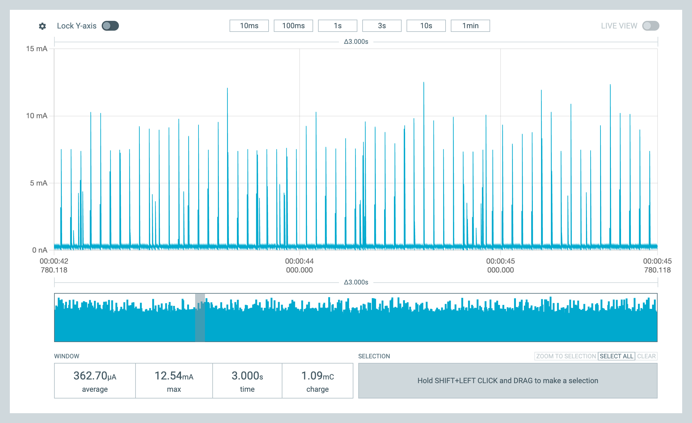](./assets/state-1-connected-362uA.png) | A peer subscribed, status frames every 500 ms |
| **State 2 — Advertising OPEN** (`FAST_1`) | **570 µA** | 30–60 ms | [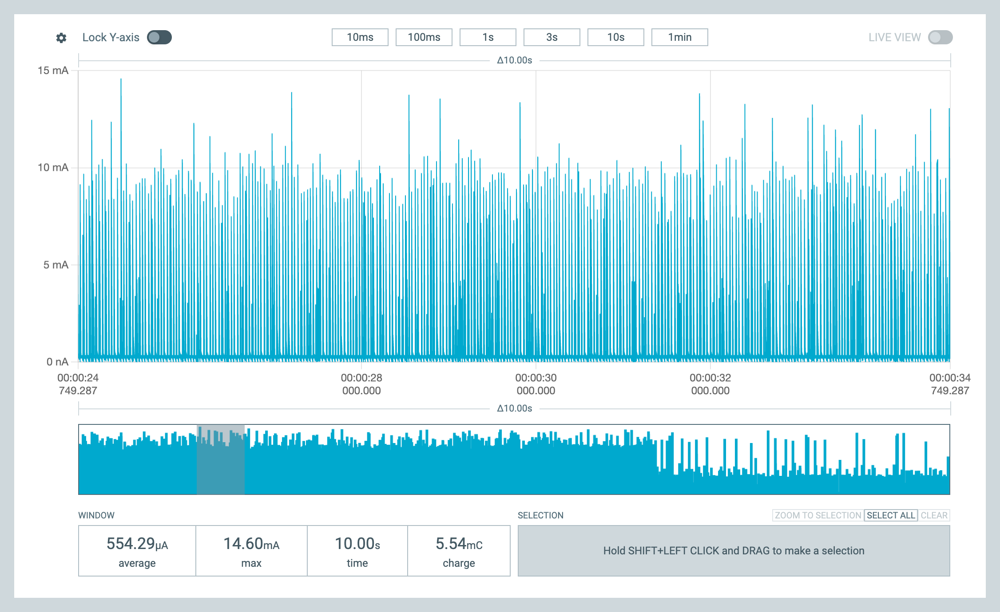](./assets/state-2-open-adv-570uA.png) | First 120 s after boot, no peer connected |
| **State 3 — Advertising BONDED_ONLY** (`FAST_2`) | **381 µA** | 100–150 ms | [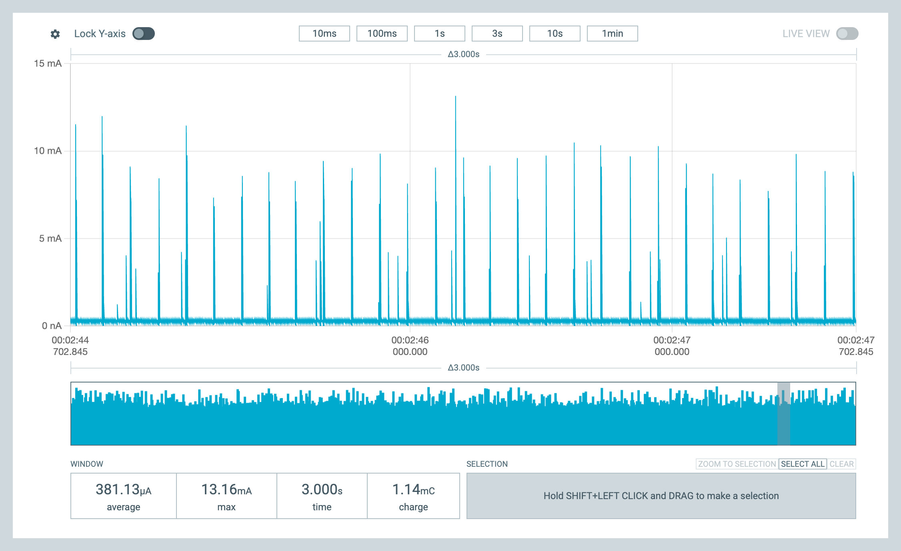](./assets/state-3-bonded-adv-381uA.png) | After successful pairing OR after 120 s window expired with a bond in the FAL |
| **State 4 — Quiet** (BONDED_ONLY, FAL empty) | **290 µA** | not advertising | [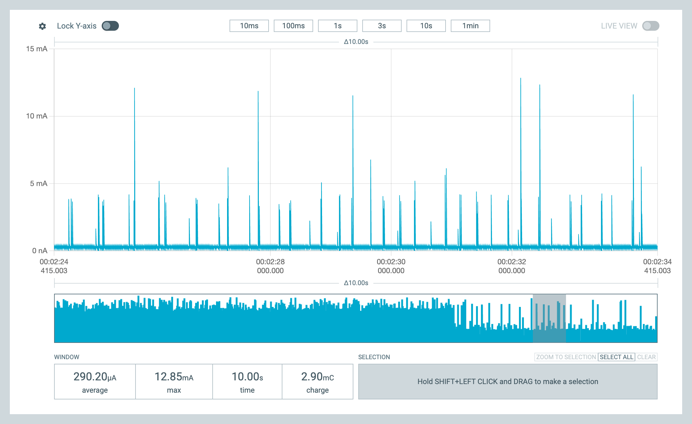](./assets/state-4-quiet-290uA.png) | After 120 s with no pairing AND no existing bond — soft-bricked, hold BUTTON3 to recover |

#### Counter-intuitive finding: connected is cheaper than open advertising

Ranked cheapest to most expensive:

```
State 4 (Quiet)             290 µA  ← no radio, background only
State 1 (Connected+notify)  362 µA  ← surprisingly cheap
State 3 (BONDED_ONLY adv)   381 µA  ← marginally costlier than connected
State 2 (OPEN adv FAST_1)   570 µA  ← most expensive
```

The intuition that "a live BLE connection costs more than just advertising" turns out to be **wrong** for this firmware. Reason:

- **OPEN advertising (FAST_1)** transmits on all 3 BLE advertising channels every 30–60 ms = ~75 radio TX events per second. The chip is constantly waking the radio, hitting the LNA + PA, switching channels.
- **Connected + notifying** has connection events at the negotiated interval (typically 30–100 ms). Most of those events are empty packets — just a 2-byte poll/ACK exchange to keep the link alive. Our status notify only injects a real payload once every 500 ms. The connection event itself is much shorter than a 3-channel adv burst.

Net: connection events average less radio-on-time per second than FAST_1 advertising. ESP-IDF firmware on similar hardware shows the same pattern.

#### Radio cost decomposition

Subtracting the 290 µA "Quiet" floor (pure background — HFXO calibration, idle PWM peripheral, I2C idle, kernel tick interrupts, BLE controller bookkeeping) from each state gives the radio's marginal contribution:

| State | Total | minus background | Radio cost |
|---|---|---|---|
| State 4 | 290 µA | 290 µA | **0 µA** (no radio) |
| State 1 | 362 µA | 290 µA | **72 µA** (conn events + occasional notify TX) |
| State 3 | 381 µA | 290 µA | **91 µA** (FAST_2 adv ~8 events/s × 3 channels) |
| State 2 | 570 µA | 290 µA | **280 µA** (FAST_1 adv ~25 events/s × 3 channels) |

The FAST_1 vs FAST_2 ratio is ~3× (matches the interval ratio). State 2's 280 µA is the radio working hardest the firmware ever has it work.

The 290 µA "Quiet" floor is the **asymptote for further optimization** without changing the firmware's core behavior — it's what the SoC + non-radio peripherals fundamentally cost.

### Watching state transitions live

Two transitions are documented from real captures:

**State 2 → State 4 transition** — fresh `west flash --erase`, no bond on either side, leave alone 3 minutes. At the 120-s mark the OPEN pairing window expires; with an empty FAL the firmware stops advertising entirely. Average steps down from ~570 µA → ~290 µA. The post-transition right half of the chart is essentially flat — no radio events at all.

[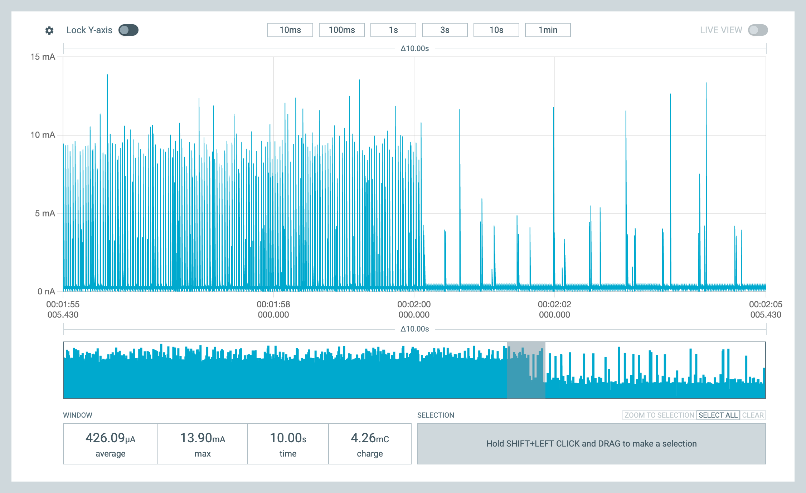](./assets/state-transition-2-to-4.png)

**State 1 → State 3 transition** — peer pairs/connects via nRF Connect Mobile, then disconnects. The 120-s window doesn't matter for this transition — the moment of peer disconnect triggers the re-arm in BONDED_ONLY mode (FAST_2) since the bond is in the FAL. Average steps from ~362 µA → ~381 µA.

[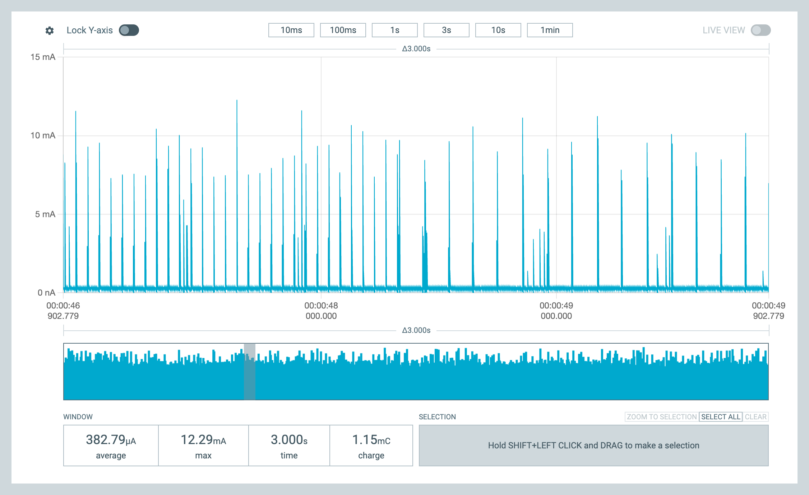](./assets/state-transition-1-to-3.png)

#### Comparing FAST_1 vs FAST_2 visually

A single screenshot can show the radio-rate difference directly — left half is FAST_1 (~25 events/s), right half is FAST_2 (~8 events/s):

[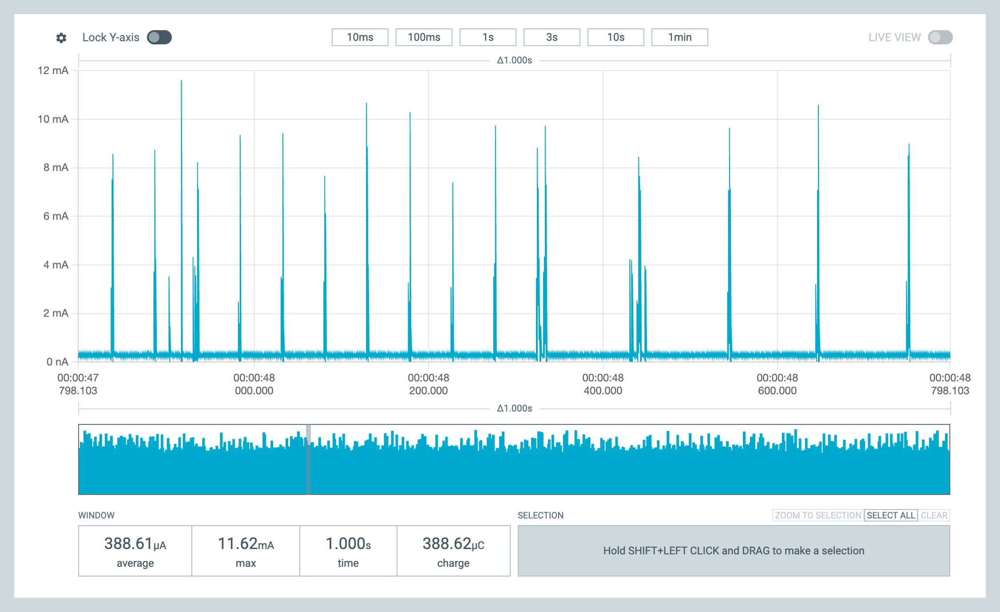](./assets/zoom-fast1-vs-fast2.png)

#### Single-event zooms

A single BLE adv event (~10 mA peak, ~0.5 ms wide) — useful for computing the charge cost of one transmission:

[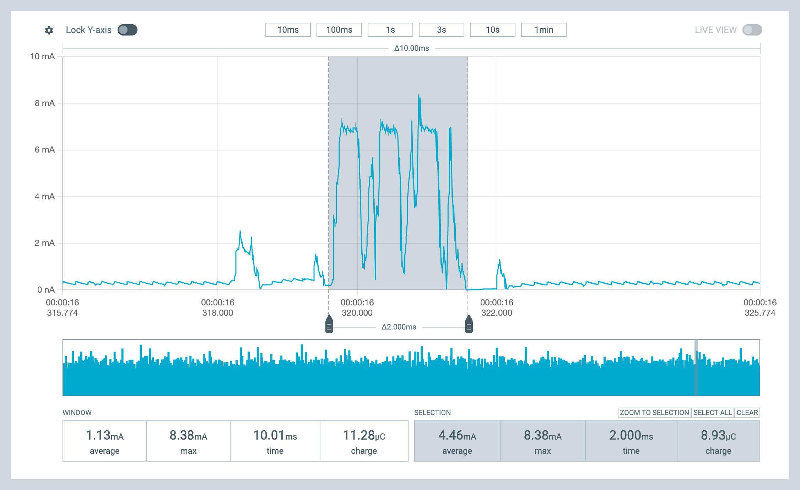](./assets/zoom-single-adv-event.png)

A status notify event during a connection — wider envelope, includes both the conn-event ACK and the notification TX:

[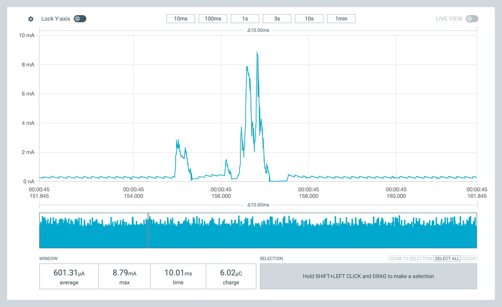](./assets/zoom-status-notify.png)

### Practical implication for power-budget planning

For a battery-powered version of this firmware, the duty cycle between states determines battery life. **Recalculated with measured numbers** on a 240 mAh CR2477 cell:

| Usage pattern | Approximate split | Average current | CR2477 life |
|---|---|---|---|
| User actively monitors via phone (always connected) | 100 % State 1 | **362 µA** | **~28 days** |
| User checks app a few times a day, ~1 min per check | 1 % State 1, 99 % State 3 | **381 µA** | ~26 days |
| User configured once, then ignored | 100 % State 3 | **381 µA** | ~26 days |
| Always-on advertising for fresh-device discovery | 100 % State 2 | **570 µA** | ~18 days |
| Worst case — fresh device, no bonds, 120 s elapsed | 100 % State 4 (advertising off!) | **290 µA** | ~34 days* |

\* State 4 has the *lowest* current but is functionally unusable — no one can connect. Hold BUTTON3 to recover.

**Surprising result:** "always connected" (State 1) actually gives the **longest usable battery life** of any reachable steady state — beating BONDED_ONLY advertising slightly. So a battery-powered variant of this product would benefit from keeping the app open continuously rather than disconnecting between checks. That's the opposite of what most BLE power-saving guidance assumes.

The biggest opportunity is **avoiding State 2** if power matters. Right now the firmware sits in OPEN advertising for 120 s after every boot. For battery-powered use, dropping the pairing window to 30 s (or making it user-initiated via BUTTON3) would save significant power for a device that mostly already has a bond.

### Hardware setup photos

Reference photos of the PPK2 + DK + (optional) oscilloscope setup used for these measurements:

[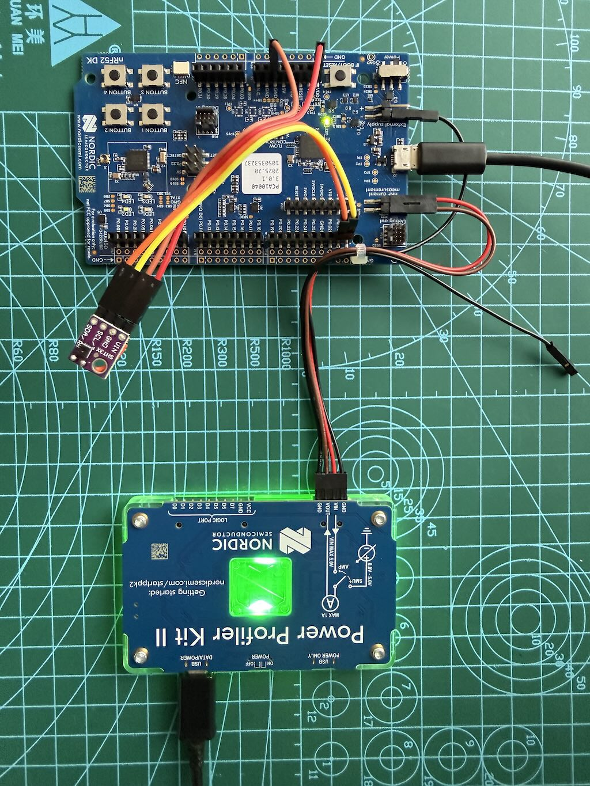](./assets/nrf_board_ppk2.jpg)
[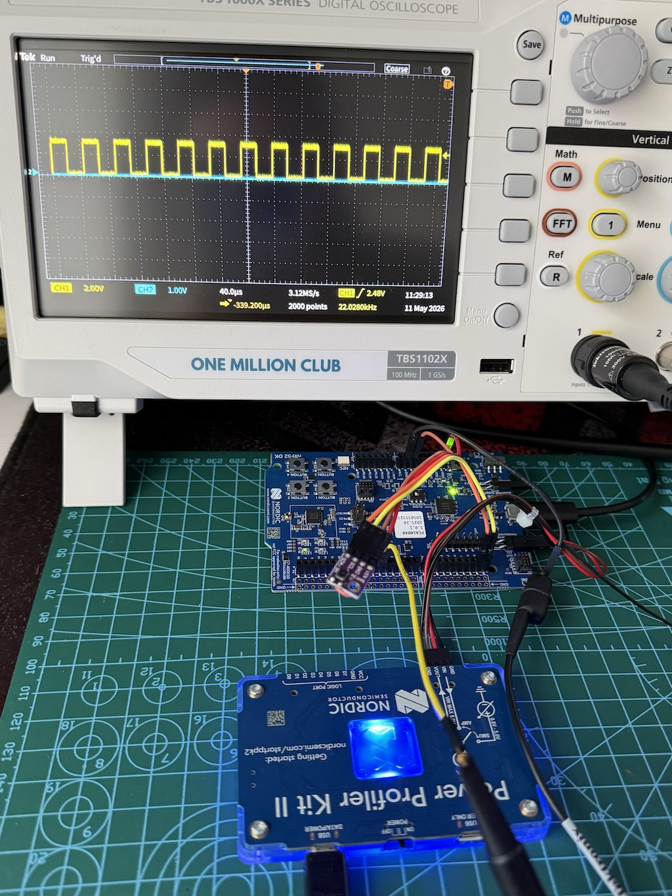](./assets/nrf_board_ppk2_oscope.jpg)

A short clip of a live capture session (45 MB, stored in Git LFS — click play to stream):

<video controls preload="none" width="800" poster="./assets/nrf_board_ppk2_oscope.jpg">
  <source src="./assets/nrf_board_ppk2_oscope.mp4" type="video/mp4">
  Your browser does not support inline video. <a href="./assets/nrf_board_ppk2_oscope.mp4">Download the video</a> instead.
</video>

**Suggested CSV naming for raw captures** (one per state, save via `File → Save data`):

```
power-state-1-connected-362uA.csv
power-state-2-open-adv-570uA.csv
power-state-3-bonded-adv-381uA.csv
power-state-4-quiet-290uA.csv
```

Save all four whenever the firmware changes — that's the quantitative model of every steady state, which lets future "what does this Kconfig change do?" questions have a precise answer instead of one summary number.

### Where the 290 µA "Quiet" floor goes

Decomposition (estimated, since these are all simultaneous):

- HFXO calibration cycles
- PWM peripheral kept active even at 0 % duty (~50 µA)
- I2C peripheral idle currents (sensor thread polls every 500 ms)
- Zephyr kernel tick/timer interrupt overhead
- BLE controller's own bookkeeping (state machine, link layer housekeeping)

Further optimizations available if needed for a battery-powered variant:

1. **Reduce pairing-window time.** Currently 120 s in `ble_svc.c`. Drop to 30 s — saves ~280 µA × 90 s per boot, plus reduces the "average if user power-cycles often" weight.
2. **Slower advertising in BONDED_ONLY.** Currently `BT_LE_ADV_CONN_FAST_2` (100–150 ms). Switching to `BT_LE_ADV_CONN_SLOW` (1000–1500 ms) drops state-3 radio cost ~10× — saves ~80 µA. Cost: phone takes longer to find device.
3. **Disable PWM when fan is off.** Even at 0 % duty the peripheral is running. Gating it saves ~50 µA.
4. **Slower sensor sample rate.** 500 ms → 5 s saves a few µA.
5. **Slower status notify period.** 500 ms → 5 s saves a few µA per connected event.

For a wall-powered fan controller, **290–381 µA is more than fine**. For a battery-powered variant, the levers above could plausibly land in the 80–150 µA range without much application-code change.

### How to use power_profile.conf

The power-only Kconfigs live in `power_profile.conf` at the project root, separate from `prj.conf`. This keeps everyday builds with the boot log + serial intact, and lets power-profile builds drop them when needed.

**Everyday development build** (with logs on the J-Link VCOM):

```sh
west build -b nrf52dk/nrf52832 -p always .
west flash
```

**Power-profile build** (silent serial, lower baseline):

```sh
west build -b nrf52dk/nrf52832 -p always . -- -DEXTRA_CONF_FILE=power_profile.conf
west flash
```

The `-DEXTRA_CONF_FILE` argument layers the file on top of `prj.conf` — same as Zephyr's standard overlay mechanism for additional config fragments. Reverting to a normal build is just a matter of dropping the `-- -D…` argument.

### Diagnostic flow if you see "high idle current" in the future

1. **Capture the chart**, note the average and the baseline-vs-event ratio. Then identify which BLE state the device is in (see "State-dependent power regimes" — the same firmware ranges from 290 µA to 570 µA depending on state, before you change anything).
2. **If the average is well above the expected state's measured value** (e.g. > 600 µA in State 3) → something is keeping the SoC out of deep sleep. Check:
   - UART (`CONFIG_SERIAL=n` — biggest hammer)
   - PWM running with 0 % duty (gate the driver)
   - I2C / SPI / other peripherals held active
3. **If average matches the expected state but events are still dense** → it's the radio. Check adv/connection interval.
4. **If the average matches the State 4 Quiet floor (~290 µA on this firmware)** → you've hit the SoC + non-radio peripheral asymptote. Further reductions require gating peripherals (PWM, I2C) at the application level.

The non-obvious lessons from this project:

- **CPU PM (`CONFIG_PM=y`) is necessary but not sufficient.** A single peripheral with clocks held active will dominate over CPU-idle savings. Profile `SERIAL=n` first.
- **The same firmware has 4 different "idle currents" depending on BLE state.** Always note which state you're in when quoting a number, otherwise the comparison is meaningless.
- **Connected can be cheaper than open advertising.** For this firmware: State 1 (362 µA) < State 2 (570 µA). Don't assume "make it disconnect to save power" without measuring.

---

## Sources

- [Power Profiler Kit II — official product page](https://www.nordicsemi.com/Products/Development-hardware/Power-Profiler-Kit-2)
- [Power Profiler Kit II — User Guide (Nordic docs)](https://docs.nordicsemi.com/bundle/ug_ppk2/page/UG/ppk/PPK_user_guide_Intro.html)
- [Preparing the nRF52 DK for current measurements (Nordic infocenter)](https://infocenter.nordicsemi.com/topic/ug_nrf52832_dk/UG/dk/prepare_board.html)
- [Current measurement guide: PCA10040 (Nordic DevZone)](https://devzone.nordicsemi.com/nordic/b/archives/posts/current-measurement-guide-measuring-current-with-p)
- [NRF52832 DK PCA10040 current measurement (DevZone)](https://devzone.nordicsemi.com/f/nordic-q-a/78131/nrf52832-dk---pca10040-current-measurement)
